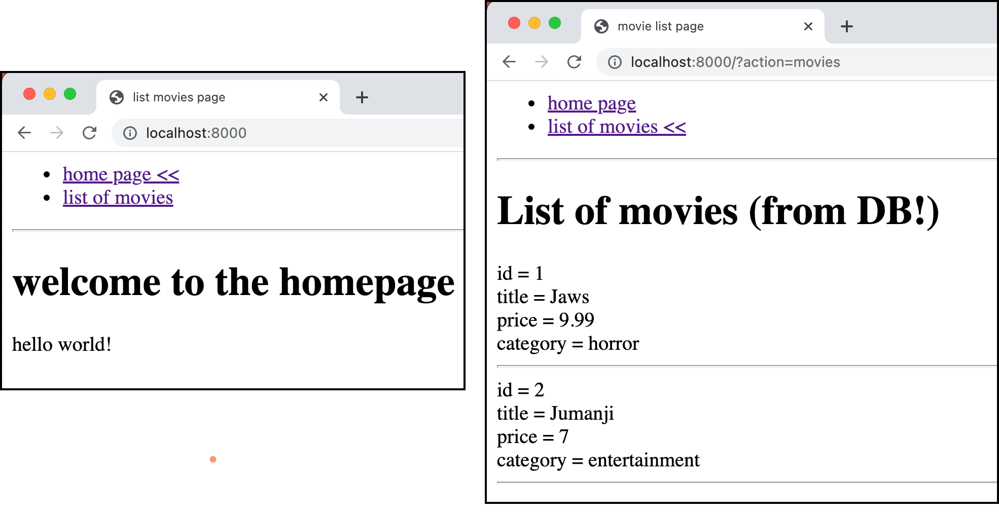

# pdo-crud-for-free-repositories-sample-project


This sample project illustrates how to use the PHP package:

- [pdo-crud-for-free-repositories](https://github.com/dr-matt-smith/pdo-crud-for-free-repositories)

    - visit that repository and look at the README to learn how to use the library ...

All code is (intended :-) to follow PSR-1, PSR-12 coding standards. Classes are following the PSR-4 autoloading standard.

## Install 1 - Get the files on your computer
Via Composer with the `create-project` option, change `demo1` to whatever you want the project folder name to be:

```bash
composer create-project mattsmithdev/pdo-repo-project demo1
```

Via Git clone:

``` bash
    $ git clone git@github.com:dr-matt-smith/pdo-crud-for-free-repositories-sample-project.git
```

Or just download the project ZIP from Github.

## Install 2 - Declare your MySQL database settings in `/.env`

File `.env` defines the 5 required constants for DB access.

You will need an up-and-running MySQL (or compatible) DB server to use this project. Ensure you know the DB user and password for programs to connect and communicate with the DB server.

Update them as required for your own MySQL setup:
```
    MYSQL_USER=root
    MYSQL_PASSWORD=passpass
    MYSQL_HOST=127.0.0.1
    MYSQL_PORT=3306
    MYSQL_DATABASE=evote
```

NOTE: These variables names are chosen for easy deployment to Fortrabbit [https://www.fortrabbit.com/](https://www.fortrabbit.com/)

- you'd think they'd want to buy me a coffee or something for advertising them ... :-)

## Install 3 - Run the migration and initial data fixtures script

There is a Composer script shortcut setup for you: `"setupdb": "php db/migrateAndLoadFixtures.php"`

So you can just type at the command line:

```bash
    $ composer setupdb
```

In folder `db` is a file `migrateAndLoadFixtures.php`. By running this script your create the DB table `movie`, and insert 2 initial records (with auto-increment IDs):

```php
    $movieRepository->createAndInsert('Jaws', 9.99, 'horror');
    $movieRepository->createAndInsert('Jumanji', 7, 'entertainment');
```

The database and table will be created automatically if they don't already exist.

## Run the web server

Run your web server, making `/public` the web root:

```bash
  $ php -S localhost:8000 -t public
```

Or use Composer script shortcut:

```bash
    $ composer serve
```

## Open a browser 
Open a browser to `http://localhost:8000`

or whatever port at which your webserver is running:




## About this project

The features of this project can be summaraised as follows:

- a single 'Front Controller' file `public/index.php` creates an `Application` object and invokes its `run()` method
- the `run()` method tests for a url-encoded variable `action`
- if url-encoded variable `action` has value `movies` then method `Application->list_movies()` is invoked, otherwise method `Application->index()` is invoked
- `Application->index()` displays template file `templates/homepage.php` - a basic home page, with a 2-item navigation bar (to home and movie list)
- `Application->list_movies()` creates a `MovieRepository` object and uses its `findAll()` method to create an array containing `Movie` objects for each row retrieved from the database table `movie`, then displays template file `templates/movies_list.php` - a page that loops through the `$movies` array, and also displays a 2-item navigation bar (to home and movie list)

The `Movie` class is a simple entity class - with an int `id` property, properties for movie objects (like title and price), and public getters and setters.

The `MovieRepository` class extends the library class `Mattsmithdev\PdoCrudRepo\DatabaseTableRepository` (which has been copied by Composer into the `vendor` directory). These library classes provide a **very simple** ORM (Object-Relational Mapper), allowing basic CRUD operations with no need to manually create DB connections or write SQL etc.

For more information about the pdo-crud-for-free-repositories library see that project's Github page:

- [https://github.com/dr-matt-smith/pdo-crud-for-free-repositories](https://github.com/dr-matt-smith/pdo-crud-for-free-repositories)


have fun

.. matt smith .. Jan 2022
